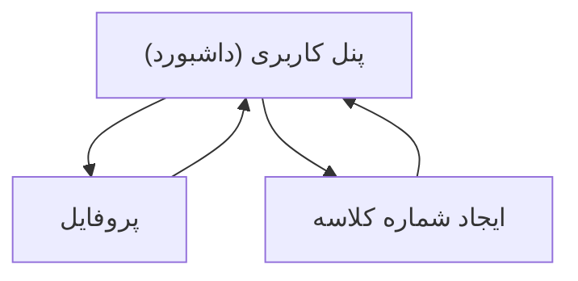

## 1. Product Overview
هدف این تغییر، تبدیل بخش‌های «پروفایل»، «پنل کاربری» و «ایجاد شماره کلاسه» به صفحات منوییِ مستقل و یکپارچه‌سازی هدر در همه‌ی آن‌هاست.
در هدر باید «اداره {شهر}» و تاریخ‌وساعت روز نمایش داده شود.

## 2. Core Features

### 2.1 Feature Module
صفحات ضروری این نیازمندی:
1. **پنل کاربری (داشبورد)**: منوی ناوبری به صفحات کاربری، هدر مشترک با «اداره {شهر}» و تاریخ‌وساعت.
2. **پروفایل**: نمایش محتوای فعلی پروفایل در صفحه‌ی مستقل (بدون تغییر منطق)، با همان هدر مشترک.
3. **ایجاد شماره کلاسه**: انتقال فرآیند/فرم فعلی ایجاد شماره کلاسه به صفحه‌ی مستقل + نمایش نتیجه، با همان هدر مشترک.

### 2.2 Page Details
| Page Name | Module Name | Feature description |
|---|---|---|
| پنل کاربری (داشبورد) | هدر مشترک | نمایش متن «اداره {شهر}» (مقداردهی از تنظیمات/کاربر/سیستم) + نمایش تاریخ‌وساعت روز و به‌روزرسانی دوره‌ای (مثلاً هر 60 ثانیه). |
| پنل کاربری (داشبورد) | منوی کاربری | نمایش آیتم‌های منو برای رفتن به «پروفایل» و «ایجاد شماره کلاسه» و صفحه‌ی جاری (پنل). |
| پروفایل | محتوای پروفایل | نمایش محتوای فعلی پروفایل به‌صورت صفحه‌ی مستقل و قابل دسترس از منو. |
| ایجاد شماره کلاسه | فرم/فرآیند ایجاد | دریافت ورودی‌های لازم مطابق منطق فعلی، ثبت/ایجاد شماره کلاسه، نمایش پیام موفق/خطا و نتیجه‌ی ایجاد شده. |

## 3. Core Process
- شما وارد «پنل کاربری» می‌شوید و از منو بین «پروفایل» و «ایجاد شماره کلاسه» جابه‌جا می‌شوید.
- در تمام این صفحات، هدر ثابت است و «اداره {شهر}» و تاریخ‌وساعت روز را نمایش می‌دهد.
- در «ایجاد شماره کلاسه»، شما فرم را تکمیل می‌کنید، ثبت انجام می‌شود و نتیجه در همان صفحه نمایش داده می‌شود.

