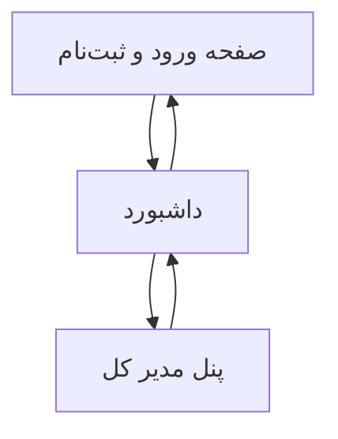

## 1. Product Overview
یک اپ ساده‌ی فارسی برای مدیریت و استفاده از داده‌ها با دو نقش «مدیر کل/کاربر».
هدف: ورود امن، نمایش/ثبت/ویرایش داده‌ها به‌صورت AJAX و نگهداری در دیتابیس MySQL.

## 2. Core Features

### 2.1 User Roles
| نقش | روش ثبت‌نام/ورود | دسترسی‌های اصلی |
|------|-------------------|-----------------|
| کاربر | ثبت‌نام/ورود با ایمیل و رمز | مشاهده لیست داده‌ها، ساخت/ویرایش/حذف رکوردهای خودش، مشاهده پروفایل |
| مدیر کل | حساب از قبل ایجادشده یا ارتقاء نقش در دیتابیس | همه‌ی دسترسی‌های کاربر + مدیریت کاربران، مشاهده/ویرایش/حذف همه رکوردها، تغییر نقش کاربران |

### 2.2 Feature Module
1. **صفحه ورود و ثبت‌نام**: ورود/ثبت‌نام، بازیابی رمز، خروج.
2. **داشبورد (خانه پس از ورود)**: ناوبری، پروفایل، لیست داده‌ها، فرم ایجاد/ویرایش، عملیات AJAX و وضعیت‌ها.
3. **پنل مدیر کل**: مدیریت کاربران، مدیریت همه داده‌ها، تغییر نقش، گزارش ساده فعالیت.

### 2.3 Page Details
| Page Name | Module Name | Feature description |
|-----------|-------------|---------------------|
| صفحه ورود و ثبت‌نام | احراز هویت | ورود با ایمیل/رمز، ثبت‌نام، بازیابی رمز، نمایش خطا/موفقیت، ریدایرکت به داشبورد پس از موفقیت |
| صفحه ورود و ثبت‌نام | مدیریت نشست | ذخیره/بازیابی نشست، خروج از حساب، جلوگیری از دسترسی بدون ورود |
| داشبورد | ناوبری و دسترسی‌ها | نمایش منوی اصلی و وضعیت نقش، مخفی‌سازی گزینه‌های مدیریتی برای کاربر |
| داشبورد | پروفایل | نمایش اطلاعات پایه کاربر، ویرایش نام نمایشی/شماره (اختیاری)، مشاهده نقش |
| داشبورد | مدیریت داده‌ها (CRUD) | دریافت لیست با AJAX، صفحه‌بندی ساده/جستجوی متنی، ایجاد/ویرایش/حذف رکورد، فقط روی داده‌های مجاز کاربر |
| داشبورد | وضعیت‌های AJAX | نمایش Loading/Empty/Error، جلوگیری از ارسال تکراری، به‌روزرسانی خوش‌بینانه یا ری‌فچ پس از عملیات |
| پنل مدیر کل | مدیریت کاربران | مشاهده لیست کاربران، تغییر نقش کاربر/مدیر کل، غیرفعال‌سازی دسترسی در سطح اپ (پرچم فعال/غیرفعال) |
| پنل مدیر کل | مدیریت همه داده‌ها | مشاهده و فیلتر رکوردهای همه کاربران، ویرایش/حذف رکوردهای دیگران، ثبت دلیل حذف/ویرایش (اختیاری) |
| پنل مدیر کل | گزارش فعالیت ساده | نمایش آخرین عملیات‌ها (ایجاد/ویرایش/حذف) به‌صورت جدول (حداقلی) |

## 3. Core Process
- جریان کاربر:
  1) ورود/ثبت‌نام → 2) مشاهده داشبورد و لیست داده‌ها → 3) ایجاد/ویرایش/حذف رکوردهای خودش با AJAX → 4) خروج.
- جریان مدیر کل:
  1) ورود → 2) داشبورد (همان امکانات کاربر) → 3) ورود به پنل مدیر کل → 4) مدیریت کاربران و همه داده‌ها → 5) خروج.

