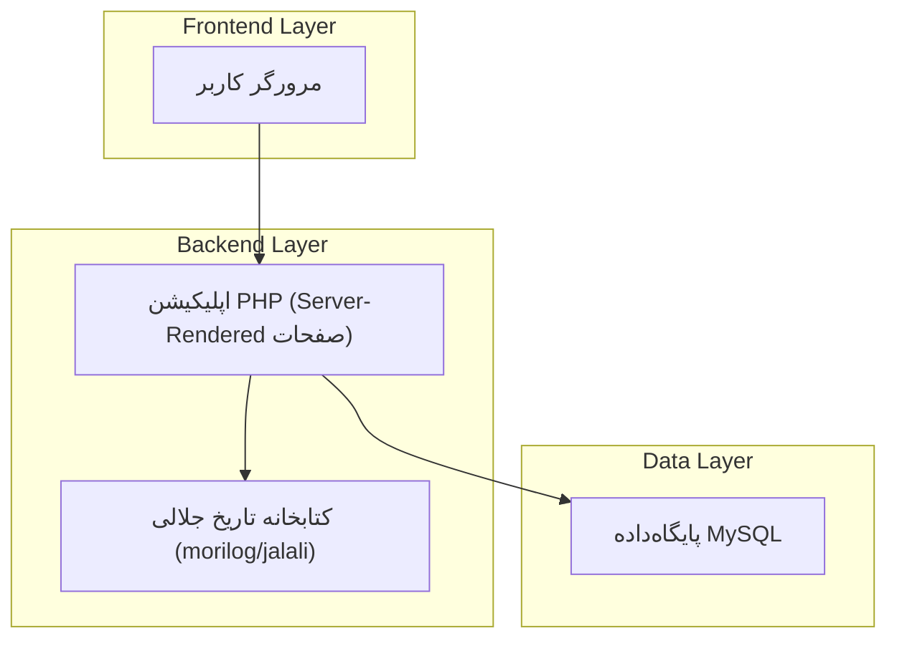
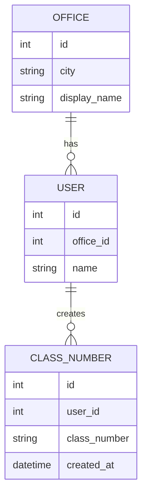

## 1.Architecture design


## 2.Technology Description
- Frontend: HTML + CSS + JavaScript (حداقلی برای به‌روزرسانی ساعت)
- Backend: PHP@8.2
- Database: MySQL
- Date/Locale: morilog/jalali (نمایش تاریخ شمسی)

## 3.Route definitions
| Route | Purpose |
|---|---|
| /dashboard | صفحه پنل کاربری + منو + هدر مشترک |
| /profile | صفحه پروفایل به‌صورت مستقل از منو |
| /class-number/create | صفحه ایجاد شماره کلاسه (فرم) |
| /class-number (POST) | ثبت ایجاد شماره کلاسه و برگشت نتیجه |

## 6.Data model(if applicable)
### 6.1 Data model definition


### 6.2 Data Definition Language
OFFICE
```
CREATE TABLE office (
  id INT AUTO_INCREMENT PRIMARY KEY,
  city VARCHAR(80) NOT NULL,
  display_name VARCHAR(120) NOT NULL
);
```
USER
```
CREATE TABLE user (
  id INT AUTO_INCREMENT PRIMARY KEY,
  office_id INT NULL,
  name VARCHAR(120) NOT NULL
);
```
CLASS_NUMBER
```
CREATE TABLE class_number (
  id INT AUTO_INCREMENT PRIMARY KEY,
  user_id INT NOT NULL,
  class_number VARCHAR(60) NOT NULL,
  created_at DATETIME NOT NULL DEFAULT CURRENT_TIMESTAMP
);
```