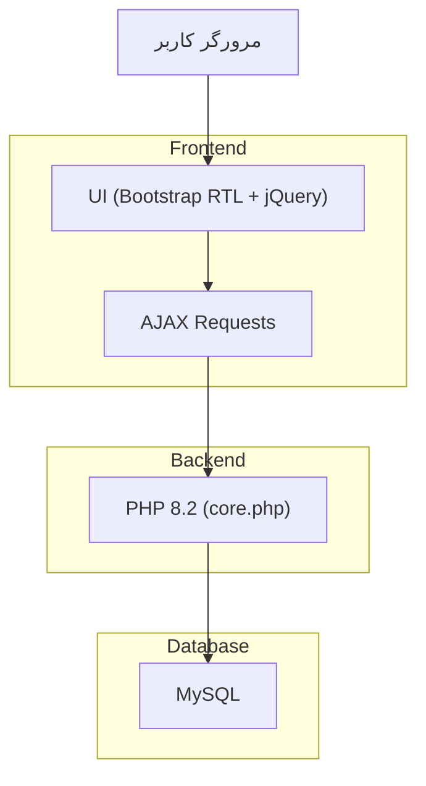
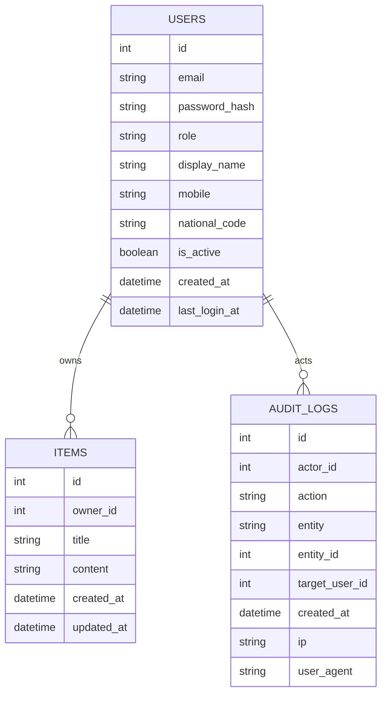

## 1.Architecture design


## 2.Technology Description
- Frontend: Bootstrap 5 (RTL) + jQuery (AJAX) + Vazirmatn (Local)
- Backend: PHP 8.2 (یک فایل منطق: core.php) + Session-based Auth
- Database: MySQL (utf8mb4)
- Package manager: Composer (vendor/autoload.php)
- Jalali Date: morilog/jalali
- Iranian Validation: persian-validator/national-code + persian-validator/mobile

## 3.Route definitions
| Route | Purpose |
|-------|---------|
| /index.php | UI اصلی (نمایش صفحه ورود یا داشبورد بر اساس session) |
| /core.php | Endpoint واحد برای همه عملیات AJAX (JSON) |

## 6.Data model(if applicable)

### 6.1 Data model definition


### 6.2 Data Definition Language
Users (users)
```
CREATE TABLE items (
  id INT UNSIGNED AUTO_INCREMENT PRIMARY KEY,
  owner_id INT UNSIGNED NOT NULL,
  title VARCHAR(200) NOT NULL,
  content TEXT,
  created_at DATETIME NOT NULL,
  updated_at DATETIME NOT NULL
);

CREATE INDEX idx_items_owner_id ON items(owner_id);
CREATE INDEX idx_items_created_at ON items(created_at DESC);

CREATE TABLE audit_logs (
  id INT UNSIGNED AUTO_INCREMENT PRIMARY KEY,
  actor_id INT UNSIGNED NOT NULL,
  action VARCHAR(30) NOT NULL,
  entity VARCHAR(30) NOT NULL,
  entity_id INT UNSIGNED,
  target_user_id INT UNSIGNED,
  ip VARCHAR(45),
  user_agent VARCHAR(255),
  created_at DATETIME NOT NULL
);

CREATE INDEX idx_audit_logs_actor_id ON audit_logs(actor_id);
CREATE INDEX idx_audit_logs_created_at ON audit_logs(created_at DESC);

-- دسترسی‌ها در این معماری از طریق MySQL User/Permission + منطق PHP اعمال می‌شود.
-- (RLS نداریم؛ کنترل دسترسی در core.php انجام می‌شود.)
```
